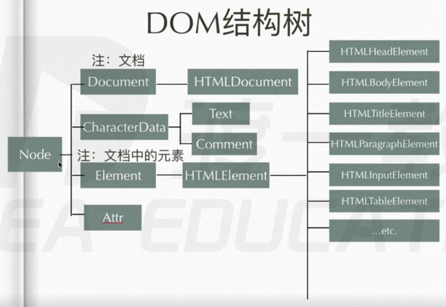

<h4 align="center">DOM结构树</h4>
<p align="center"></p>

#### 选择器

```javascript

document.getElementById('') //Document
document.getElementsByName('') //HTMLDocument
document.getElementsByTagName('') //Document Element
document.getElementsByClassName('') //Document Element

document.querySelector('') //Document Element
document.querySelectorAll('') //Document Element

document.documentElement // Document
document.head  document.body // HTMLDocument

```

#### 遍历节点树、遍历元素节点树

```javascript

//遍历节点树
dom.parentNode
dom.childNodes
dom.firstChild
dom.lastChild
dom.previousSibling
dom.nextSibling

dom.attributes 该节点身上的属性节点集合（name可读、value可写）


//遍历元素节点树
dom.parentElement
dom.children
dom.firstElementChild
dom.lastElementChild
dom.previousElementSibling
dom.nextElementSibling


//nodeName、nodeValue、nodeType
dom.nodeName
dom.nodeValue //文本、注释节点才有，可写
dom.nodeType //1元素节点 2属性节点 3文本节点 8注释节点 9document节点 11文档碎片节点

```

#### DOM节点增删改插

```javascript

document.createElement('div')
document.createTextNode('文本节点')
document.createComment('注释节点')
document.createDocumentFragment()

Fdom.removeChild(Sdom)//剪切
dom.remove()

Fdom.insertBefore(Ndom,Sdom)
Fdom.replaceChild(Ndom,Sdom)//剪切

dom.appendChild(dom)//剪切

```

#### innerHTML、innerText

```javascript

dom.innerHTML
dom.innerText

```

#### getAttribute、setAttribute

```javascript
dom.getAttribute('class')
dom.setAttribute('data-test','test')
```

#### setInterval、setTimeout

```javascript
//setTimeout定时器设置延迟时间为0，也会有5毫秒延迟时间
let unqueId1 = setInterval(fun, 1000);
clearInterval(unqueId)
let unqueId2 = setTimeout(fun, 0)
clearTimeout(unqueId2)
```


